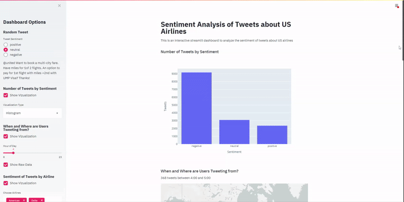

# Interactive-Dashboard-on-Airline-Sentiment

This is an interactive data dashboard built with the Streamlit library in Python. It can be accessed as a web app and run locally. I analyzed the sentiments of US airline tweets based on the data obtained from Kaggle [here](https://www.kaggle.com/crowdflower/twitter-airline-sentiment). 

The web app can be viewed here - https://share.streamlit.io/rohitsathish/interactive-dashboard-on-airline-sentiment/main/streamlit.py

  

